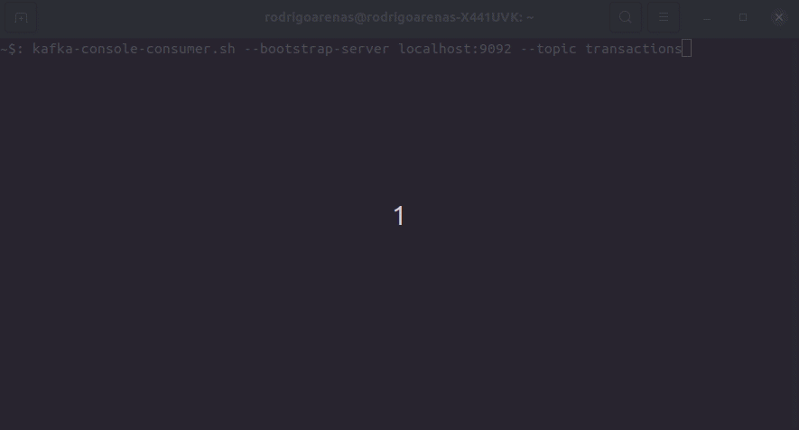
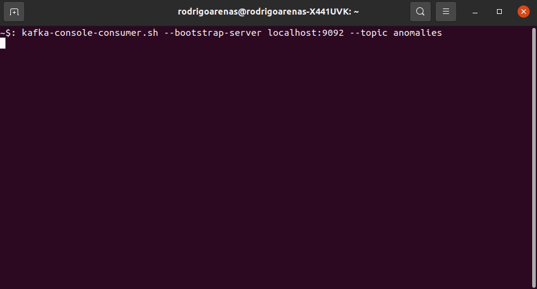
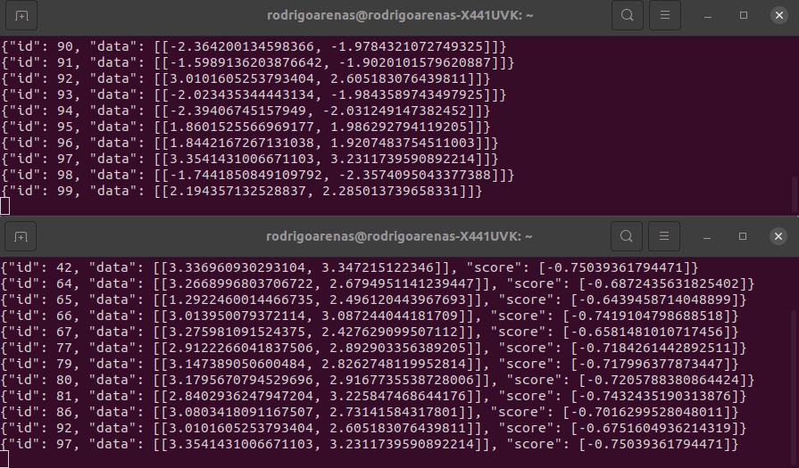
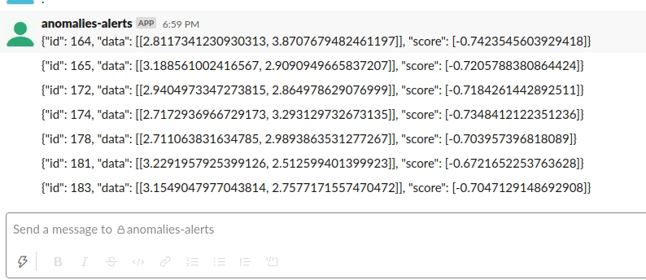

# kafkaml-anomaly-detection
Project for real time anomaly detection using kafka and python

It's assumed that zookeeper and kafka are running in the localhost, it follows this process:

- Train an unsupervised machine learning model for anomalies detection
- Save the model to be used in real time predictions
- Generate fake streaming data and send it to a kafka topic
- Read the topic data with several subscribers to be analyzed by the model
- Predict if the data is an anomaly, if so, send the data to another kafka topic
- Subscribe a slack bot to the last topic to send a message in slack channel if
an anomaly arrives

This could be illustrated as:


Article explaining how to run this project: [medium](https://towardsdatascience.com/real-time-anomaly-detection-with-apache-kafka-and-python-3a40281c01c9)


# Demo
Generate fake transactions into a kafka topic:


Predict and send anomalies to another kafka topic


Producer and anomaly detection running at the same time




Send notifications to Slack


# Usage:

* First train the anomaly detection model, run the file:

```bash
model/train.py
```

* Create the required topics

```bash
kafka-topics.sh --zookeeper localhost:2181 --topic transactions --create --partitions 3 --replication-factor 1
kafka-topics.sh --zookeeper localhost:2181 --topic anomalies --create --partitions 3 --replication-factor 1
```

* Check the topics are created

```bash
kafka-topics.sh --zookeeper localhost:2181 --list
```

* Check file **settings.py** and edit the variables if needed

* Start the producer, run the file

```bash
streaming/producer.py
```

* Start the anomalies detector, run the file

```bash
streaming/anomalies_detector.py
```

* Start sending alerts to Slack, make sure to register the env variable SLACK_API_TOKEN,
then run

```bash
streaming/bot_alerts.py
```
